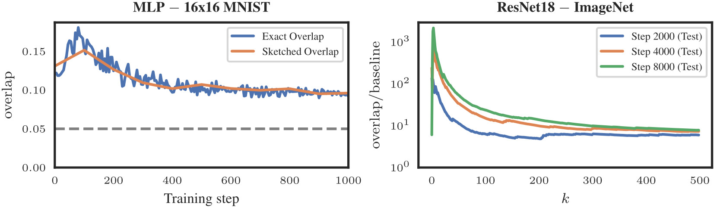
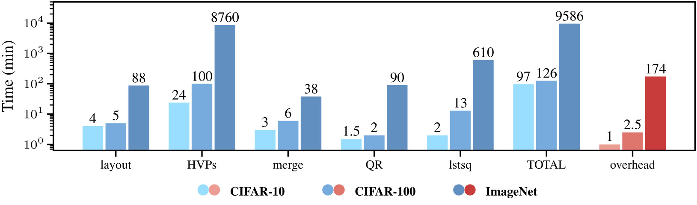

# Connecting Parameter Magnitudes and Hessian Eigenspaces at Scale using Sketched Methods

**Figure 1: Overlap between top-k parameter magnitude masks and top-k Hessian eigenspaces is consistently and substantially above random chance**



**Figure 15: Runtimes of main SEIGH operations to compute a single Hessian eigendecomposition**




This repository contains general functionality to perform sketched eigendecompositions on matrix-free linear operators, such as the Hessian for deep learning, as well as to support the experiments done as part of the paper. Main entry points are the Python/SLURM scripts located at the root of the repository, and the Jupyter notebooks inside the `assets` directory. Specifically:

* [01_crystallization_and_grassmannians.ipynb](assets/notebooks/01_crystallization_and_grassmannians.ipynb): This notebook renders figures showing mask/Hessian early crystallization, as well as the reviewed Grassmannian metrics for the 16x16 MNIST experiment.

* [02_mnist_mini_overlaps.ipynb](assets/notebooks/02_mnist_mini_overlaps.ipynb): This notebook plots the overlap against different masks (magnitude, best, random) and the baseline for the 16x16 MNIST experiment.

* [03_cifar_and_imagenet.ipynb](assets/notebooks/03_cifar_and_imagenet.ipynb): This notebook renders different plots involving the *sketched* overlap for the CIFAR 10/100 and ImageNet experiments.

* [10a_grassmannian_metrics.ipynb](assets/notebooks/10a_grassmannian_metrics.ipynb): This notebook conducts the synthetic experiment conducted to investigate the behavior of different Grassmannian metrics, as well as the corresponding results.

* [10b_runtimes.ipynb](assets/notebooks/10b_runtimes.ipynb): This notebook contains code to generate the SEIGH runtimes plot.

* [skerch](skerch): This python library, implemented by us, provides functionality to implement sketched matrix-free decompositions on top of PyTorch, including the `SSVD` and `SEIGH` algorithms covered in the paper.

* [10a_gather_params_grads.py](10a_gather_params_grads.py): Trains a DeepOBS problem and logs parameters and gradients along the way. See script for usage example and documentation. The homonymous Slurm script issues this script call as a job to a computational cluster.

* [10b_prepare_hdf5_measurements.slurm](10b_prepare_hdf5_measurements.slurm): In order to perform Hessian measurements in a distributed and parallelized way, a distributed HDF5 array is created to host said measurements. Allocating large amounts of memory takes time, so it is adviced to do this just once at the beginning and then recycle the array for subsequent Hessians.

* [10c_hessian_hdf5_measurements.py](10c_hessian_hdf5_measurements.py): Performs random Hessian measurements at a given training step. It requires `10a` and `10b`. The homonymous Slurm script issues this script call as a job to a computational cluster.

* [10d_core_and_analysis.py](10d_core_and_analysis.py): Merges performed Hessian measurements into the monolithic HDF5 array, and solves the *core sketch* in order to obtain the sketched eigendecomposition in its final form. Then performs the numerical analysis (e.g. computing quantities needed to measure the *overlap*, see paper), and logs them into a file. The homonymous Slurm script issues this script call as a job to a computational cluster.

* The [11a_run_sketched_overlap_cifar10_3c3d.sh](11a_run_sketched_overlap_cifar10_3c3d.sh), [11b_run_sketched_overlap_cifar100_allcnnc.sh](11b_run_sketched_overlap_cifar100_allcnnc.sh) and [11c_run_sketched_overlap_imagenet_resnet18.sh](11b_run_sketched_overlap_cifar100_allcnnc.sh) shell scripts orchestrate all steps described before in order to perform large-scale experiments in a distributed fashion, on a Slurm cluster.

* [12a_mnist_mini_exhaustive_test.py](12a_mnist_mini_exhaustive_test.py): Trains mnist_mini, and, for the requested steps, computes both the sketched and the true EIGH in-RAM, providing a log with format similar to the one produced by 10d.

* [20a_curvlinops_checks.py](20a_curvlinops_checks.py): This script, free of side effects, simply tries to load a DeepOBS problem and create a CurvLinOps operator, in order to check if there are any issues with the setup, and allow for easier debugging. Typical issues include nondeterministic behaviour of the Hessian linear operator due to numerical instalbiliby (since e.g. `NaN != NaN`) or random augmentations in the dataloader.

To reproduce the results from the paper, run the corresponding notebooks/scripts. Example runs with ad-hoc values can be found below (see paper and corresponding docstrings for more details). Note that the large-scale experiments are meant to be run on a [Slurm](https://slurm.schedmd.com/documentation.html) computational cluster, and have not been fully tested otherwise. Furthermore, the Slurm scripts have been redacted for anonymization purposes.


### Installation:

For deep learning numerical computations, we use [PyTorch](https://pytorch.org/) and [CurvLinOps](https://github.com/f-dangel/curvlinops). To organize the deep learning experiments, we use [DeepOBS](https://github.com/fsschneider/DeepOBS).

Installation instructions (Ubuntu):

```
conda create -n hessov python==3.9
conda activate hessov
#
conda install pytorch==1.13.0 torchvision==0.14.0 pytorch-cuda=11.6 -c pytorch -c nvidia
conda install -c conda-forge omegaconf==2.3.0
conda install -c conda-forge matplotlib==3.6.2
conda install -c anaconda h5py==3.7.0
conda install -c anaconda scipy==1.10.1
#
pip install 'git+https://github.com/fsschneider/DeepOBS.git@develop#egg=deepobs'
pip install coloredlogs==15.0.1
pip install curvlinops-for-pytorch==1.1.0
pip install torch-dct
# backend PyTorch API became inconsistent, this fixes it:
pip install --upgrade torch torchvision
```

A full description of the environment can be seen in [assets/requirements.txt](assets/requirements.txt).


### Running the distributed experiments:

In the lack of a Slurm computational cluster, the commands below can be run sequentially to emulate an example of a scalable, distributed experiment. Tested on Ubuntu:

```
# create directory to store results (i.e. OUTPUT_DIR)
mkdir -p output

# train a small DeepOBS problem and gather parameters and metadata
deepobsdir=~/datasets/DeepOBS
python 10a_gather_params_grads.py OBS_DATASETS=$deepobsdir TUNING_CONF=config/basic_config.yaml OPTIMIZER=SGD PROBLEM=mnist_mini RANDOM_SEED=12345 OUTPUT_DIR=output OUTDIR_SUFFIX=__slurm_job_id RECORD_STEPS="[0,1,100,200,300]" MAX_STEPS=300 NUM_HESSIAN_DATAPOINTS=100

# prepare distributed HDF5 array to store random Hessian measurements
measdir=./output/measdir
mkdir -p $measdir
python -m skerch create_hdf5_layout --hdf5dir output/measdir/ --dtype float32 --shape 7030,7030 --outer 50 --inner 100 --sym

# prepare monolithic HDF5 array to solve core sketches
outer_all=$measdir/leftouter_ALL.h5
outer_merged=$measdir/leftouter_MERGED.h5
inner_all=$measdir/inner_ALL.h5
inner_merged=$measdir/inner_MERGED.h5
python -m skerch merge_hdf5 --in_path $outer_all --out_path $outer_merged
python -m skerch merge_hdf5 --in_path $inner_all --out_path $inner_merged

# store measurements for training Hessian at step 0
jobpath=./output/2024_03_21_02_09_31.164__mnist_mini__12345____slurm_job_id
logpath=$jobpath/2024_03_21_02_09_31.164[10a_gather_params_grads.py].log
parampath=$jobpath/2024_03_21_02_09_31.164__mnist_mini__12345____slurm_job_id__params.h5
meas_idxs="["`python -c "print(','.join(str(x) for x in range(0, 100)))"`"]"
python 10c_hessian_hdf5_measurements.py OBS_DATASETS=$deepobsdir PARAMS_PATH=$parampath TRAINING_LOGPATH=$logpath MEASUREMENTS_DIR=$measdir MEASUREMENT_IDXS=$meas_idxs NUM_INNER=100 NUM_OUTER=50 SUCCESS_FLAG=measured STEP=0 TEST_HESSIAN=0

# solve core sketch, compute and log final quantities for this Hessian
python 10d_core_and_analysis.py OBS_DATASETS=$deepobsdir SUCCESS_FLAG=measured TRAINING_LOGPATH=$logpath PARAMS_PATH=$parampath STEP=0 TEST_HESSIAN=0 NUM_A_POSTERIORI=30 INNER_VIRTUAL=$inner_all OUTER_VIRTUAL=$outer_all INNER_MONOLITHIC=$inner_merged OUTER_MONOLITHIC=$outer_merged
```

Results are logged to the terminal and also saved into `OUTPUT_DIR`. Note that these are test commands to ensure the software is running properly, and the parameters are purposedly small to speed up computations. Realistic experiments may take substantially longer, as reported in the paper.


### Running the exhaustive `mnist_mini` experiment:

In the lack of a Slurm computational cluster, the commands below can be run sequentially to emulate an example of an exhaustive experiment. Tested on Ubuntu:

```
deepobsdir=~/datasets/DeepOBS
python 12a_mnist_mini_exhaustive_test.py OBS_DATASETS=$deepobsdir OUTPUT_DIR=output TUNING_CONF=config/basic_config.yaml OPTIMIZER=SGD RANDOM_SEED=12345 NUM_HESSIAN_DATAPOINTS=10 MAX_STEPS=16001 RECORD_STEPS="[0,100]" NUM_OUTER=10 NUM_INNER=20
```

Results are logged to the terminal and also saved into `OUTPUT_DIR`. Note that this is a test command to ensure the software is running properly, and the parameters are purposedly small to speed up computations. Realistic experiments may take substantially longer.
